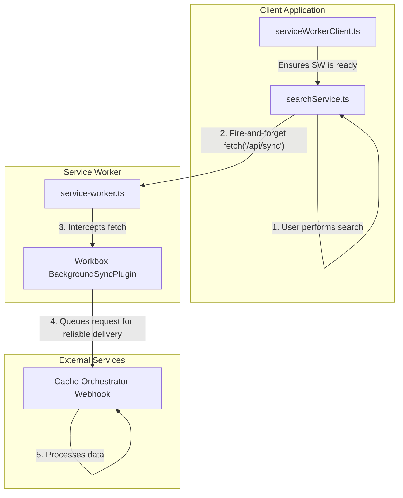

# Cache Sync Implementation for SearchGPT

## Overview

This document provides a technical overview of the cache synchronization mechanism implemented in the SearchGPT project. This system is designed to collect, deduplicate, and persist anonymous, fingerprinted search results for instant recall, leveraging a Service Worker with Workbox for robust background sync. It is intended for new developers onboarding to the project to understand the architecture, usage, debugging, and troubleshooting processes.

## Purpose

The cache sync system addresses the need for instant, privacy-preserving search results by fingerprinting anonymous queries at the edge, merging duplicates, and persisting them for quick access. It minimizes repeated LLM and vector searches by using a cache-aside orchestration pattern, ensuring sub-100 ms skeleton responses via edge cache hits while respecting PII compliance by storing only non-identifying fingerprints.

## Architecture

The architecture uses a "client-initiated sync" model. The client application is responsible for triggering the synchronization, and a Service Worker makes the process robust and network-resilient. This eliminates the complex, error-prone message passing of previous designs.

### Key Components

1.  **`serviceWorkerClient.ts`**: This client-side module manages the Service Worker lifecycle. It provides a simple promise (`swReady`) that resolves only when the worker is active and has completed a "ping-pong" handshake. This guarantees that the worker is ready to handle requests before the application tries to use it.

2.  **`searchService.ts`**: After processing a search, this service initiates the synchronization. It calls `fetch('/api/sync', ...)` in a "fire-and-forget" manner, without `await`. This ensures the UI remains responsive while the sync request is handed off to the Service Worker.

3.  **`service-worker.ts`**: The Service Worker's role is now highly focused and simplified:
    *   It uses Workbox to define a route that specifically intercepts `POST` requests to `/api/sync`.
    *   It applies the `BackgroundSyncPlugin` to this route. This is the core of the new strategy. If the initial `fetch` fails (e.g., due to lost connectivity), Workbox automatically queues the request and retries it later when the network is available.
    *   It no longer contains complex logic for data filtering, message passing, or configuration management.

4.  **`vite.config.ts`**: The configuration uses the `injectManifest` strategy, which gives us full control over the custom `service-worker.ts` file while still benefiting from Workbox's build-time optimizations. `registerType: 'autoUpdate'` and `self.skipWaiting()` in the worker ensure that the latest version is always active during development.

## Implementation Details

The core of the implementation is the interaction between the client application and the Service Worker, orchestrated by Workbox.

1.  **Service Worker Readiness (`serviceWorkerClient.ts`)**:
    *   The application doesn't attempt to sync data until it's certain the Service Worker is ready.
    *   The `swReady` promise solves this by performing a "ping-pong" handshake. The client sends a "ping" message, and the promise only resolves when the worker responds with a "pong". This handshake is detailed in `ADR-010`.

2.  **Initiating the Sync (`searchService.ts`)**:
    *   After a search is complete, the service waits for `swReady` to resolve.
    *   It then calls `fetch('/api/sync', ...)` with the search results in the request body.
    *   Crucially, this call is **not** awaited. It's a "fire-and-forget" operation. This keeps the UI responsive, as the main thread is not blocked waiting for the network request to complete.

3.  **Reliable Delivery (`service-worker.ts`)**:
    *   The Service Worker has a route registered with Workbox that specifically matches `POST` requests to `/api/sync`.
    *   This route uses the `NetworkOnly` strategy but is enhanced with the `BackgroundSyncPlugin`.
    *   If the `fetch` call fails (e.g., the user goes offline), Workbox automatically adds the request to a queue in IndexedDB.
    *   When network connectivity is restored, Workbox replays the request from the queue, guaranteeing the data is eventually delivered to the webhook.

## Usage

### Running the Application

1.  **Development**: Run `npm run dev`. The `vite-plugin-pwa` is configured for a seamless development experience. The Service Worker will auto-update on changes, preventing the "stale worker" problem.
2.  **Build**: Run `npm run build`. Vite and `vite-plugin-pwa` will create a production-optimized build, including the final `sw.js` file.

### Configuring the Webhook URL

-   The webhook URL is managed via the `VITE_CACHE_WEBHOOK_URL` environment variable. This is accessed in `searchService.ts` and included in the body of the `/api/sync` request. The Service Worker itself does not need to know this URL.

## Debugging and Troubleshooting

### Key Tools

-   **Browser Developer Tools**:
    -   **Application Tab**: Go to `Application > Service Workers` to see the current worker status, force updates, and go offline to test the background sync queue.
    -   **Console Tab**: Look for logs from `logger.ts` to trace the flow from the client to the Service Worker.
    -   **Network Tab**: Filter for `/api/sync` to inspect the request payload. When you go offline and trigger a sync, you will see the request fail here, but it will be queued by Workbox.

### Common Scenarios

1.  **How to Test Background Sync**:
    -   In DevTools, go to the **Network** tab and select "Offline".
    -   Perform a search in the application. You will see the `fetch` to `/api/sync` fail in the console.
    -   Go back to the **Network** tab and switch back to "Online".
    -   In the **Application** tab, under `Storage > IndexedDB > workbox-background-sync > requests`, you will see the queued request disappear as Workbox successfully sends it.

2.  **Service Worker Not Updating**:
    -   **Symptom**: Code changes don't seem to apply.
    -   **Fix**: The current setup with `registerType: 'autoUpdate'` and `self.skipWaiting()` should prevent this. However, a hard refresh (Cmd+Shift+R or Ctrl+Shift+R) or manually unregistering the old worker in the `Application` tab will resolve any lingering issues.

3.  **Sync Request Fails with 4xx/5xx Error**:
    -   **Symptom**: The `fetch` request in the Network tab shows a server error, and the request remains in the Workbox queue.
    -   **Fix**: This indicates an issue with the receiving webhook, not the client-side code. Check the webhook server's logs. Workbox will continue to retry, so the data is not lost, but the server-side issue must be resolved.

## Conclusion

The current cache sync implementation is a robust, resilient, and modern system that leverages the strengths of Service Workers and Workbox. By moving to a "client-initiated sync" model, we have eliminated the complexity and fragility of the previous message-passing architecture. The new system is easier to understand, debug, and maintain, and it provides a superior user experience by never blocking the main thread on network operations. The documentation has been updated to reflect this simpler, more powerful design.
