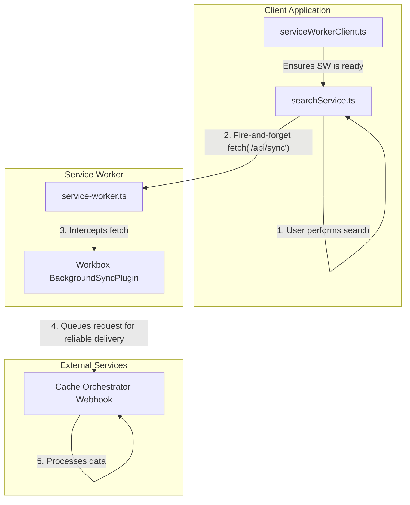

# Cache Sync Implementation for SearchGPT

## Overview

This document provides a technical overview of the cache synchronization mechanism implemented in the SearchGPT project. This system is designed to collect, deduplicate, and persist anonymous, fingerprinted search results for instant recall, leveraging a Service Worker with Workbox for robust background sync. It is intended for new developers onboarding to the project to understand the architecture, usage, debugging, and troubleshooting processes.

## Purpose

The cache sync system addresses the need for instant, privacy-preserving search results by fingerprinting anonymous queries at the edge, merging duplicates, and persisting them for quick access. It minimizes repeated LLM and vector searches by using a cache-aside orchestration pattern, ensuring sub-100 ms skeleton responses via edge cache hits while respecting PII compliance by storing only non-identifying fingerprints.

## Architecture

The architecture uses a hybrid cache synchronization model combining both "push" and "pull" mechanisms for robust, network-resilient synchronization. This approach ensures compatibility across different browsers while providing an optimal user experience with immediate syncs when the app is in use, eliminating the complex, error-prone message passing of previous designs.

### Key Components

1.  **`serviceWorkerClient.ts`**: This client-side module manages the Service Worker lifecycle. It provides a simple promise (`swReady`) that resolves only when the worker is active and has completed a "ping-pong" handshake. This guarantees that the worker is ready to handle requests before the application tries to use it.

2.  **`searchService.ts`**: After processing a search, this service initiates synchronization using the push model. It sends a `CACHE_NEW_ENTRY` message to the Service Worker to trigger immediate synchronization, ensuring real-time data updates across all browsers.

3.  **`service-worker.ts`**: The Service Worker's role is focused on handling synchronization requests:
    *   It uses Workbox to define a route that intercepts synchronization requests.
    *   It applies the `BackgroundSyncPlugin` for the pull model, queuing requests and retrying them when connectivity is restored on supported browsers.
    *   It processes `CACHE_NEW_ENTRY` messages from the push model to sync data immediately when notified by the application.

4.  **`vite.config.ts`**: The configuration uses the `injectManifest` strategy, providing full control over the custom `service-worker.ts` file while benefiting from Workbox's build-time optimizations. `registerType: 'autoUpdate'` and `self.skipWaiting()` in the worker ensure that the latest version is always active during development.

5.  **`main.tsx`**: Registers the Background Sync API with the tag 'sync-cache' for the pull model, enabling background synchronization on supported browsers (e.g., Chrome) as a progressive enhancement.

## Implementation Details

The core of the implementation is the hybrid interaction between the client application and the Service Worker, combining immediate push notifications with background pull synchronization for robust delivery.

1.  **Service Worker Readiness (`serviceWorkerClient.ts`)**:
    *   The application doesn't attempt to sync data until it's certain the Service Worker is ready.
    *   The `swReady` promise solves this by performing a "ping-pong" handshake. The client sends a "ping" message, and the promise only resolves when the worker responds with a "pong". This handshake is detailed in `ADR-010`.

2.  **Push Model - Immediate Sync (`searchService.ts`)**:
    *   After a search is complete and results are saved to the cache, the service waits for `swReady` to resolve.
    *   It then sends a `CACHE_NEW_ENTRY` message to the Service Worker to trigger immediate synchronization.
    *   This operation ensures real-time updates and works across all browsers, including those without Background Sync API support.

3.  **Pull Model - Background Sync (`main.tsx`)**:
    *   During Service Worker registration, the application checks for Background Sync API support.
    *   If supported, it registers with `registration.sync.register('sync-cache')` to enable background synchronization events.
    *   This allows sync to occur even when the app is not open, as a progressive enhancement on browsers like Chrome.

4.  **Reliable Delivery (`service-worker.ts`)**:
    *   The Service Worker handles both push and pull sync triggers, executing the same `syncCacheData()` function for consistent logic.
    *   For the pull model, Workbox's `BackgroundSyncPlugin` queues requests in IndexedDB if connectivity is lost, replaying them when the network is restored.
    *   This guarantees that data is eventually delivered to the webhook, enhancing resilience.

## Usage

### Running the Application

1.  **Development**: Run `npm run dev`. The `vite-plugin-pwa` is configured for a seamless development experience. The Service Worker will auto-update on changes, preventing the "stale worker" problem.
2.  **Build**: Run `npm run build`. Vite and `vite-plugin-pwa` will create a production-optimized build, including the final `sw.js` file.

### Configuring the Webhook URL

-   The webhook URL is managed via the `VITE_CACHE_WEBHOOK_URL` environment variable. This is accessed in `searchService.ts` and included in the body of the `/api/sync` request. The Service Worker itself does not need to know this URL.

## Debugging and Troubleshooting

### Key Tools

-   **Browser Developer Tools**:
    -   **Application Tab**: Go to `Application > Service Workers` to see the current worker status, force updates, and go offline to test the background sync queue.
    -   **Console Tab**: Look for logs from `logger.ts` to trace the flow from the client to the Service Worker.
    -   **Network Tab**: Filter for `/api/sync` to inspect the request payload. When you go offline and trigger a sync, you will see the request fail here, but it will be queued by Workbox.

### Common Scenarios

1.  **How to Test Background Sync**:
    -   In DevTools, go to the **Network** tab and select "Offline".
    -   Perform a search in the application. You will see the `fetch` to `/api/sync` fail in the console.
    -   Go back to the **Network** tab and switch back to "Online".
    -   In the **Application** tab, under `Storage > IndexedDB > workbox-background-sync > requests`, you will see the queued request disappear as Workbox successfully sends it.

2.  **Service Worker Not Updating**:
    -   **Symptom**: Code changes don't seem to apply.
    -   **Fix**: The current setup with `registerType: 'autoUpdate'` and `self.skipWaiting()` should prevent this. However, a hard refresh (Cmd+Shift+R or Ctrl+Shift+R) or manually unregistering the old worker in the `Application` tab will resolve any lingering issues.

3.  **Sync Request Fails with 4xx/5xx Error**:
    -   **Symptom**: The `fetch` request in the Network tab shows a server error, and the request remains in the Workbox queue.
    -   **Fix**: This indicates an issue with the receiving webhook, not the client-side code. Check the webhook server's logs. Workbox will continue to retry, so the data is not lost, but the server-side issue must be resolved.

## Conclusion

The current cache sync implementation is a robust, resilient, and modern system that leverages the strengths of Service Workers and Workbox. By moving to a "client-initiated sync" model, we have eliminated the complexity and fragility of the previous message-passing architecture. The new system is easier to understand, debug, and maintain, and it provides a superior user experience by never blocking the main thread on network operations. The documentation has been updated to reflect this simpler, more powerful design.
