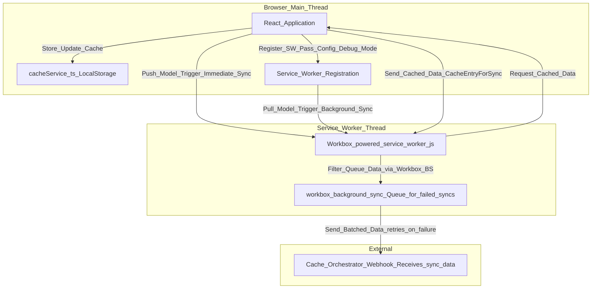

# Cache Sync Implementation for SearchGPT

## Overview

This document provides a technical overview of the cache synchronization mechanism implemented in the SearchGPT project. This system is designed to collect, deduplicate, and persist anonymous, fingerprinted search results for instant recall, leveraging a Service Worker with Workbox for robust background sync. It is intended for new developers onboarding to the project to understand the architecture, usage, debugging, and troubleshooting processes.

## Purpose

The cache sync system addresses the need for instant, privacy-preserving search results by fingerprinting anonymous queries at the edge, merging duplicates, and persisting them for quick access. It minimizes repeated LLM and vector searches by using a cache-aside orchestration pattern, ensuring sub-100 ms skeleton responses via edge cache hits while respecting PII compliance by storing only non-identifying fingerprints.

## Architecture

The implementation uses a hybrid model combining a custom Service Worker with Workbox for background sync, employing both "push" and "pull" mechanisms to ensure compatibility and optimal performance across different browsers. Below is the architectural flow:

### Key Components

1. **React Application (`src/main.tsx`)**:
   - Registers the Service Worker and passes configuration (webhook URL, debug mode).
   - Registers background sync with the tag 'sync-cache' for the "pull" model on supported browsers (e.g., Chrome).
   - Communicates with the Service Worker to provide cached data on request, using `getAllCacheEntries()` to send complete `CacheEntryForSync` objects with timestamps.

2. **Cache Service (`src/services/cacheService.ts`)**:
   - Manages local storage of search results with timestamps.
   - Provides a method (`getAllCacheEntries`) to retrieve all cached entries for sync purposes, ensuring the Service Worker has access to data with the necessary timestamp information.

3. **Search Service (`src/services/searchService.ts`)**:
   - Implements the "push" model by notifying the Service Worker of new search results immediately after they are saved to the cache, ensuring real-time synchronization across all browsers.

4. **Service Worker (`src/service-worker.ts` and `public/service-worker-dev.js`)**:
   - Custom logic to filter cache data based on the last sync timestamp using a manual `for...of` loop to avoid issues with `Array.prototype.filter` in the Service Worker context.
   - Uses Workbox's `BackgroundSyncPlugin` to queue and retry failed sync requests to the webhook.
   - Handles messages from the main thread for configuration and new cache entry notifications (`CACHE_NEW_ENTRY`) for the "push" model, and listens for background sync events for the "pull" model.

5. **Workbox Integration (`vite.config.ts`)**:
   - Configured via `vite-plugin-pwa` to generate a Workbox-powered Service Worker using the `generateSW` strategy.
   - Defines runtime caching rules and background sync capabilities for robust data synchronization.

## Implementation Details

### Service Worker Registration and Background Sync (`src/main.tsx`)

- **Background Sync Registration (Pull Model)**: Registers a background sync with the tag 'sync-cache' if supported by the browser (e.g., Chrome). This enables the Service Worker to sync data in the background, particularly useful when connectivity is restored after being offline, acting as a progressive enhancement.
- **Development Workaround**: In development mode, a static `public/service-worker-dev.js` is used to bypass MIME type issues with `vite-plugin-pwa`'s `dev-sw.js` virtual module, with `devOptions.enabled` set to `false` in `vite.config.ts` to prevent conflicts.

### Immediate Sync Trigger (`src/services/searchService.ts`)

- **Push Model**: After a new search result is saved to the cache, the `sendSearchResultsToServiceWorker()` function is called to notify the Service Worker via a `CACHE_NEW_ENTRY` message. This ensures immediate synchronization when the app is in use, working across all browsers including those without background sync support (e.g., Safari).

### Cache Data Handling (`src/services/cacheService.ts`)

- The `getAllCacheEntries` method retrieves all cache entries from `localStorage`, ensuring the Service Worker has access to the latest data for synchronization. This method returns `CacheEntryForSync` objects that include a top-level `timestamp` critical for filtering logic in the Service Worker.

### Service Worker Logic (`src/service-worker.ts` and `public/service-worker-dev.js`)

- **Message Handling**: Listens for configuration messages (`SET_CONFIG`, `SET_DEBUG_MODE`), foreground sync triggers (`TRIGGER_FOREGROUND_SYNC`), and new cache entry notifications (`CACHE_NEW_ENTRY`) from the main thread.
- **Sync Logic**: Filters cache data based on the last sync timestamp using a manual `for...of` loop to avoid issues with `Array.prototype.filter`. This ensures only new entries are sent to the configured webhook URL. When debug mode is enabled, detailed logs show when a sync is triggered, the webhook URL, and the exact sync packet being sent.
- **Workbox Background Sync**: Uses `BackgroundSyncPlugin` to queue failed requests for retry, ensuring data is eventually sent even if the initial attempt fails due to network issues.

### Workbox Configuration (`vite.config.ts`)

- Configured with `vite-plugin-pwa` to use a `generateSW` strategy, allowing Workbox to generate the Service Worker automatically for production builds without requiring manual manifest injection.
- Defines a runtime caching rule for `/sync-cache` with `NetworkOnly` and background sync enabled to handle webhook communication robustly.

## Usage

### Running the Application

1. **Development**: Run `npm run dev` to start the Vite development server. The Service Worker will be registered using the static `public/service-worker-dev.js` workaround, and you can observe sync behavior in the browser's console (with debug mode enabled by default for local development).
2. **Build**: Run `npm run build` to create a production build. The `vite-plugin-pwa` will generate the final Service Worker (`dev-dist/sw.js`) with Workbox integration using the `generateSW` strategy.

### Configuring the Webhook URL

- Set the environment variable `VITE_CACHE_WEBHOOK_URL` in a `.env` file or directly in your deployment environment to specify the target webhook for cache data synchronization. If not set, it defaults to a predefined URL or a local fallback like `http://localhost:8080/sync-cache`.

## Debugging and Troubleshooting

### Enabling Debug Mode

- Debug mode is automatically enabled when the app runs on `localhost` or `127.0.0.1`. This mode logs detailed information to the browser console from both the main thread and the Service Worker.
- Check the browser's Developer Tools (Console tab) for logs prefixed with "Service Worker:" to see sync operations, data filtering, webhook communication, and the exact sync packet being sent. Additionally, foreground sync events in the main thread log the sync interval and confirm when syncs are triggered.

### Common Issues and Fixes

1. **Service Worker Not Registering**:
   - **Symptom**: Console shows "SW registration failed" or no Service Worker is listed under Application > Service Workers in Developer Tools.
   - **Fix**: Ensure you're running the app through a server (not directly from `file://`), as Service Workers require HTTPS or localhost. Use `npm run dev` for development. In development mode, verify that `public/service-worker-dev.js` is correctly set up and that `vite-plugin-pwa`'s `devOptions.enabled` is set to `false` in `vite.config.ts` to avoid MIME type conflicts.

2. **Periodic Background Sync Not Supported**:
   - **Symptom**: Console warns "Periodic Background Sync not supported by this browser."
   - **Fix**: This is expected in browsers like Safari. The app falls back to foreground sync (when visible) and one-off sync (on connectivity changes). Verify that foreground sync logs appear when the tab is active.

3. **Webhook Sync Fails**:
   - **Symptom**: Console shows "Failed to sync cache data" with a status code (e.g., 400) or error message.
   - **Fix**: Check if the webhook URL is correct and accessible. Ensure the server at the webhook URL (e.g., Make.com scenario) is active and accepts POST requests with JSON data. Workbox will retry failed requests automatically; monitor the retry logs for resolution. If a 400 error persists, verify the external service configuration as it may not be set up to listen for incoming data.

4. **No Data Being Synced**:
   - **Symptom**: Logs show "No new data to sync" repeatedly despite new search results.
   - **Fix**: Verify that `cacheService.ts` is storing data with timestamps in `localStorage`. Check if the `getAllCacheEntries` method returns data with the correct structure (`CacheEntryForSync` objects with top-level `timestamp`). If not, ensure `src/main.tsx` is using `getAllCacheEntries()` and not `getAllSearchResults()` when responding to Service Worker requests.

5. **TypeScript Errors in `main.tsx` or `service-worker.ts`**:
   - **Symptom**: Build errors related to `import.meta.env` or Service Worker API methods.
   - **Fix**: The code uses type assertions to handle potential typing issues with Vite environment variables and Service Worker APIs. If errors persist, ensure your `tsconfig.json` is configured with `moduleResolution: "bundler"` and `target: "ES2020"` or higher, and verify that custom type definitions in `src/types/service-worker.d.ts` are correctly set up.

6. **Benign Timeout Warning**:
   - **Symptom**: Console shows "Timeout reached while waiting for cache data from main thread" even though sync succeeds.
   - **Fix**: This is a benign warning caused by a race condition or overly aggressive timeout in the Service Worker. It does not impact functionality but can be addressed by adjusting the timeout duration in `src/service-worker.ts` or `public/service-worker-dev.js` if desired.

### Debugging Tools

- **Browser Developer Tools**: Use the "Application" tab to inspect Service Worker status and "Console" for debug logs.
- **Network Tab**: Monitor outgoing requests to the webhook URL in the "Network" tab of Developer Tools to see payload and response details (e.g., `200 OK` or `400 Bad Request`).
- **Local Storage Inspection**: Check `localStorage` in the "Application" tab to verify cache entries are being stored with timestamps.

## Extending the Implementation

- **Custom Sync Intervals**: Adjust the sync interval via the `VITE_CACHE_SYNC_INTERVAL` environment variable for both periodic and foreground sync (defaults to 5 minutes for foreground sync if not set).
- **Enhanced Timestamp Storage**: Implement IndexedDB in the Service Worker for persistent `lastSyncTimestamp` storage across sessions (currently updated after each successful sync).
- **Additional Webhook Endpoints**: Extend the Service Worker to support multiple webhook URLs or endpoints based on data type or priority.
- **Timeout Optimization**: Refine the timeout mechanism in the Service Worker to eliminate benign warnings for cleaner debugging logs.

## Conclusion

This cache sync implementation provides a robust solution for SearchGPT's requirement of instant, privacy-preserving search results. By combining custom Service Worker logic with Workbox's background sync capabilities, comprehensive fallbacks, and specific workarounds for development challenges, it ensures data persistence across various browser environments. Recent resolutions to filtering logic, data structure mismatches, and webhook configuration issues have solidified the system's reliability. New developers can use this guide to understand, debug, and extend the system as needed for future enhancements.
