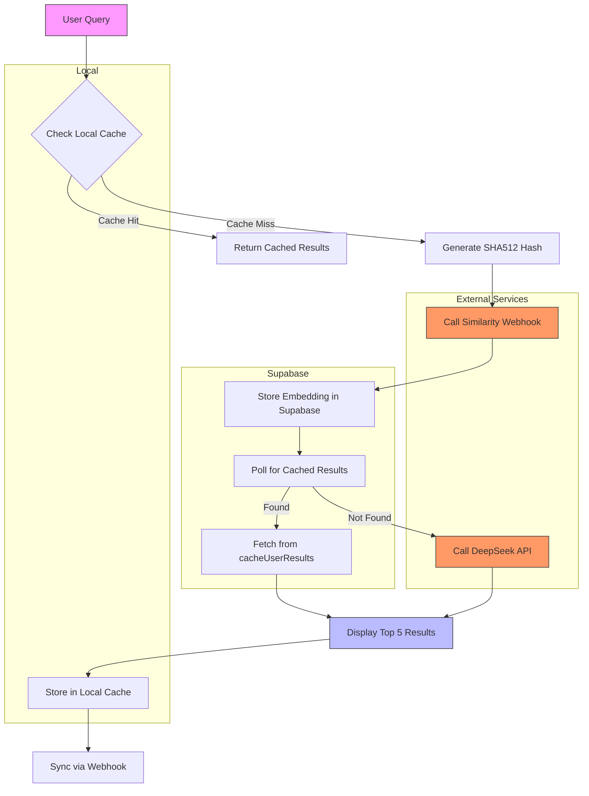

# Caching and Query Fetching Strategy Diagram

## Key Components

1. **Local Cache** (LocalStorage):
   - Stores recent search results with 24hr TTL
   - Maintains conversation threads
   - First check for query matches

2. **Supabase Cache**:
   - `cachedQueryResults`: Maps query hashes to cache entries
   - `cache`: Stores vector embeddings and metadata  
   - `cacheUserResults`: Contains actual content and sources

3. **Vector Similarity Flow**:
   - Webhook generates embeddings for new queries
   - Supabase performs vector similarity search
   - Returns top 5 most similar cached results

4. **Fallback to API**:
   - If no similar cached results found within 5 retries
   - Calls DeepSeek API for fresh results
   - Stores new results in both caches

5. **Sync Mechanism**:
   - Local cache changes synced to webhook
   - Ensures consistency across devices
