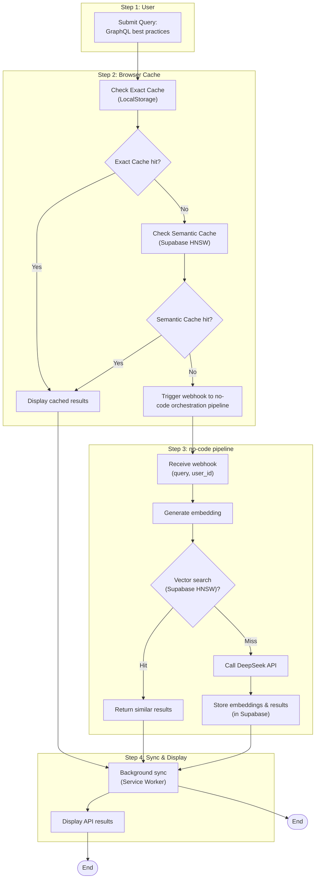

# Caching and Query Fetching Strategy Diagram

## Key Components

1.  **Dual-Phase Cache Check**:
    *   **Exact Cache (LocalStorage)**: First, the browser checks for an exact match in the local storage. If found, results are displayed instantly.
    *   **Semantic Cache (Supabase HNSW)**: If no exact match is found, a semantic search is performed against the vector database in Supabase.

2.  **No-Code Orchestration (Make.com)**:
    *   If no cache hits occur, a webhook triggers a Make.com pipeline.
    *   The pipeline generates embeddings, performs a vector search, and if necessary, calls the DeepSeek API for a fresh search.
    *   New results and their embeddings are stored in Supabase.

3.  **Background Sync (Service Worker)**:
    *   The Service Worker ensures that new results (either from cache or the API) are synced in the background.
    *   This keeps the local and remote caches consistent and provides a seamless user experience.
