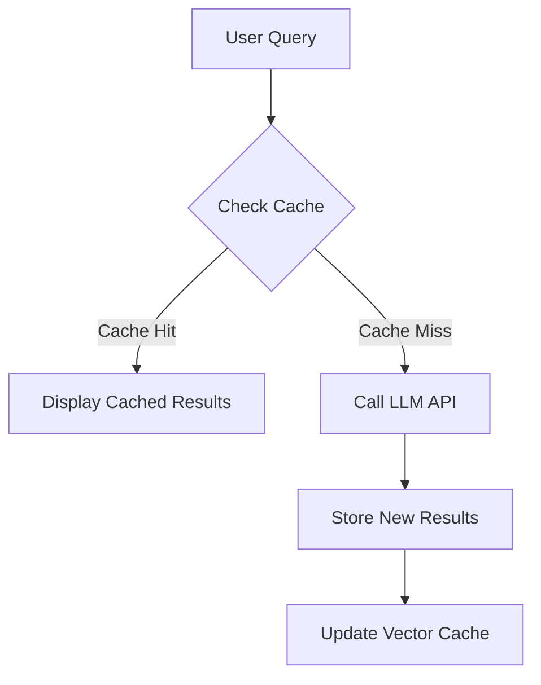

# Quick Cached Results Implementation

## Overview
The Quick Cached Results feature provides instant search results by:
1. Generating vector embeddings for queries
2. Performing similarity searches against cached results
3. Presenting relevant matches from previous searches

Key benefits:
- Reduces API calls to LLM services
- Provides faster response times for similar queries
- Maintains conversation context across sessions

## Architecture


## Webhook Integration

### Make.com Configuration
1. Create a new scenario with webhook trigger
2. Configure webhook to accept JSON payload:
```json
{
    "query": "search text",
    "content": "context category", 
    "user_id": "UUID"
}
```
3. Add steps to:
   - Generate embeddings
   - Perform vector search
   - Store results in Supabase

### Client Implementation
```typescript
// Example API call
const CACHE_SIMILARITY_QUERY_URL = import.meta.env.VITE_CACHE_SIMILARITY_QUERY_URL;
async function cacheSimilarityQuery(query: string) {
  const response = await fetch(CACHE_SIMILARITY_QUERY_URL, {
    method: 'POST',
    headers: {
      'Content-Type': 'application/json',
      'x-make-apikey': import.meta.env.VITE_CACHE_SIMILARITY_API_KEY
    },
    body: JSON.stringify({
      query,
      content: 'search',
      user_id: currentUserId
    })
  });
  return response.json();
}
```

### Environment Variables
Add to `.env.local`:
```env
VITE_CACHE_SIMILARITY_QUERY_URL=your_make_webhook_url
VITE_CACHE_SIMILARITY_API_KEY=your_make_api_key
```

## Supabase Tables

### cachedQueryResults
```sql
create table public."cachedQueryResults" (
  id bigint generated by default as identity not null,
  created_at timestamp with time zone not null default now(),
  user_id uuid not null default gen_random_uuid (),
  cache_id bigint not null,
  user_query_hash text not null,
  constraint cachedQueryResults_pkey primary key (id),
  constraint cachedQueryResults_cache_id_fkey foreign KEY (cache_id) 
    references cache (id) on update RESTRICT on delete set default
) TABLESPACE pg_default;
```

### cache
```sql
create table public.cache (
  id bigint generated by default as identity not null,
  created_at timestamp with time zone not null default now(),
  cache_user_result bigint not null,
  query_hash text not null,
  embeddings extensions.vector null,
  constraint cache_pkey primary key (id),
  constraint cache_cache_user_result_fkey foreign KEY (cache_user_result) 
    references "cacheUserResults" (id) on delete CASCADE
) TABLESPACE pg_default;

create index IF not exists cache_embeddings_hnsw 
  on public.cache using hnsw (embeddings extensions.vector_l2_ops)
  with (m = '16', ef_construction = '64') TABLESPACE pg_default;
```

### Example Queries
```sql
-- Find cached results for user query
SELECT * FROM cachedQueryResults 
WHERE user_query_hash = 'sha512hash' 
ORDER BY created_at DESC LIMIT 5;

-- Get full cached content
SELECT cur.content FROM cacheUserResults cur
JOIN cache c ON c.cache_user_result = cur.id
WHERE c.id IN (SELECT cache_id FROM cachedQueryResults WHERE user_id = 'user-uuid');
```

## Implementation Details

### SHA512 Hashing
```typescript
import { sha512 } from 'js-sha512';

function hashQuery(query: string) {
  return sha512(query.trim().toLowerCase());
}
```

### Polling Mechanism
```typescript
async function checkForCachedResults(queryHash: string, attempts = 0) {
  if (attempts >= 5) return null;
  
  const results = await supabase
    .from('cachedQueryResults')
    .select('*')
    .eq('user_query_hash', queryHash);

  if (results.data?.length) {
    return results.data;
  } else {
    await new Promise(resolve => setTimeout(resolve, 1000));
    return checkForCachedResults(queryHash, attempts + 1);
  }
}
```

## Troubleshooting

### Common Issues

**No cached results found**
1. Verify webhook is receiving requests (check Make.com logs)
2. Confirm Supabase tables have proper permissions
3. Check query hashing produces consistent results

**Webhook timeout**
1. Increase polling interval (currently 1 second)
2. Add retry logic with exponential backoff
3. Verify Make.com scenario isn't rate limited

**Supabase connection issues**
1. Check `.env.local` credentials
2. Verify network connectivity
3. Confirm tables exist in public schema

## References
- [Cache Sync Implementation](cache-sync-implementation.md)
- [Supabase Vector Docs](https://supabase.com/docs/guides/database/extensions/vector)
- [Make.com Webhooks](https://www.make.com/en/help/webhooks)
